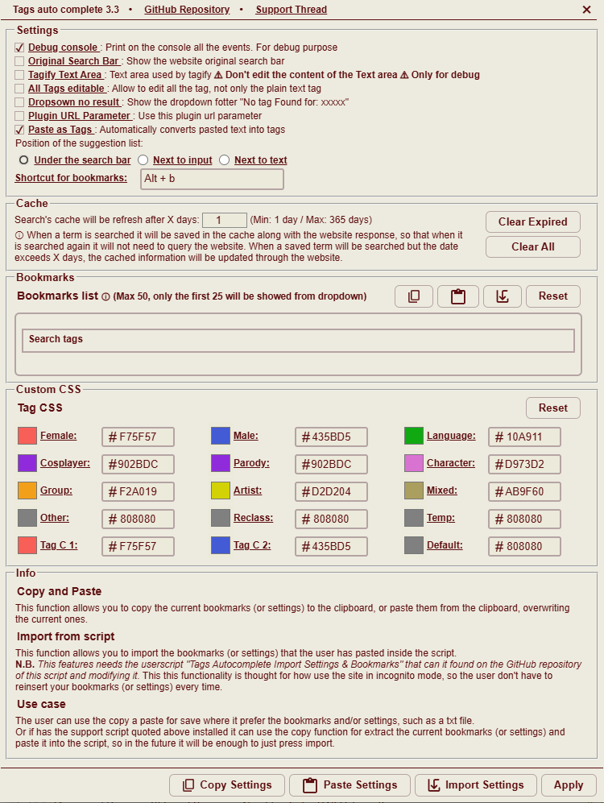

# e-hentai-helper-suite

Collection of userscripts for a better navigation on e-hentai

## e-hentai-tags-helper

   
  Replace normal search bar with new one whit autocomplete of tags

**Direct Install:** [install](https://github.com/ciccabanana/e-hentai-helper-suite/blob/master/e-hentai-tags-helper.user.js)

### Features

* Compatible with Tampermonkey, Greasemonkey and Violentmonkey
* Fast loading ~20ms
* Autocomplete of tags using site API
* Delayed API request during typing for avoid server overload
* Fast autocomplete using category index (ignore case) [see below](#Category-index)
* Colored tags by category &nbsp;
&nbsp;
&nbsp;
&nbsp;
&nbsp;
&nbsp;
&nbsp;
&nbsp;

* No duplicate allowed.
* Works both in front page and favorites search bar.
* Works on both e-hentai and sadpanda.

#### Category index

* f: => female
* m: => male
* l: => language
* p: => parody
* c: => character
* g: => group
* a: => artist
* co: => cosplayer
* x: OR mi: => mixed
* mis: => temp
* r: => reclass
* o: other

### New in the lastets version (0.2)

* Fixed the compatibility with the site
* Complete rewrite of the code.
* The script will load together with the site
* Support the Exclusion `-` and the OR `~` operator [See the ehwiki](https://ehwiki.org/wiki/Gallery_Searching#Operators). 
* * You can write the tag directly with the operator or change the operator with a left click
* Added settings interface
* * Added the possibility to change the tags color
* * Possibility to change the position of the dropdown
* Removed [@saninn/logger](https://github.com/distante/saninn-logger) dependence
* Integrated custom logger

### Settings UI preview

 

### ToDo

* [x] Settings interface
* [x] Possibility of user to personalize tags color
* [ ] Support for Qualifiers "tag:" / "weak:" / "title:" / "uploader:" / "uploaduid:" / "gid:" / "comment:" / "favnote:"
* [ ] Compatibility to work in the insertion of new tags on the gallery page (Under evaluation)
* [ ] ...

## External Tools

* [tagify](https://github.com/yairEO/tagify) (v 3.17.7)
