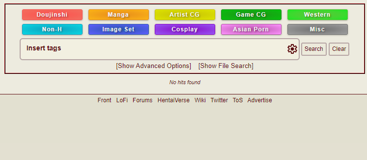
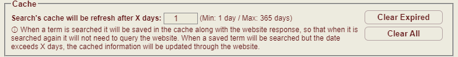
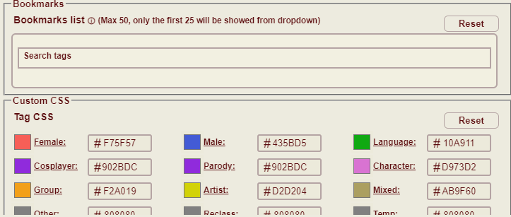

# e-hentai-helper-suite

Collection of userscripts for a better navigation on e-hentai

## Tags Auto Complete

   
  Replace normal search bar with new one whit autocomplete of tags

**[Direct Install](https://github.com/ciccabanana/e-hentai-helper-suite/raw/master/e-hentai-tags-helper.user.js)** | 
**[Support Thread](https://forums.e-hentai.org/index.php?showtopic=242709)**

### Features

-   Compatible with Tampermonkey, Greasemonkey and Violentmonkey
-   Autocomplete of tags using site API
-   Delayed API request during typing and [caching ↓](#cache) for avoid server restriction
-   Possibility of save favorites tags as bookmarks
-   Support the Exclusion `-` and the OR `~` operator [See the ehwiki](https://ehwiki.org/wiki/Gallery_Searching#Operators).
-   Supprot all qualifiers (tag, weak, title, uploader, uploaduid, gid, comment, favnote) [see below ↓](#qualifiers)
-   Fast autocomplete using namespace (ignore case) [see below ↓](#namespaces)
-   Colored tags by qualifier or namespace &nbsp;
    &nbsp;
    &nbsp;
    &nbsp;
    &nbsp;
    &nbsp;
    &nbsp;
    &nbsp;
    
-   Settings interface [see below ↓](#settings-ui-preview)
-   Keyboard and mouse [shortcut ↓](#shortcut)
-   Fast loading, the script will load alongside the website
-   No duplicate allowed.
-   Works both in front page and favorites search bar.
-   Works on both e-hentai and sadpanda.
-   Copy, Paste and Import 

### Copy, Paste and Import
With this feature the user can easily export and import the bookmarks or the setting easly with copy and paste

Using copy and import, the user can paste its bookmarks or setting in the support script "Tags Autocomplete Import Settings & Bookmarks" and import from it every time it wants. This functionality is useful for the user who use incognito mode.

N.B. The feature Import need the support script that can be installed clicking this link: **[Install support script](https://github.com/ciccabanana/e-hentai-helper-suite/raw/master/e-hentai-tags-helper.user.js)** 

For info how to use the support script read [this guide.](/doc/guide_import.md)

### Cache

This feature allows the program to save user's inputs and corresponding server responses by creating a cache. If the user re-enters the same input, the response is delivered more quickly from the cache, without needing to query the API again.

Users have the option to clear all cached data at any time or to remove only the data that is older than a specified number of days, with the ability to choose the number of days themselves.

### Bookmarks

This feature allows users to save their favorite tags and access them quickly from a dropdown menu that appears beneath the search bar when it gains focus. Users can easily add or remove favorites either through the settings or directly while searching for a tag by clicking on the bookmark icon or using the Ctrl+B keyboard shortcut.

Favorites can be saved with full details, including Namespace, Qualifiers, Exclusion operators (-), and OR operators (~). The feature supports a maximum of 50 favorite tags, with the top 25 being displayed in the dropdown menu for quick access.
Users can also reorder their favorites through the settings using a simple drag-and-drop interface.

### Namespaces
(For more info [See the ehwiki](https://ehwiki.org/wiki/Namespace))
| Simple | Namespace |
|---|---|
| a: | artist |
| c: | character |
| co: | cosplayer |
| f: | female |
| g: | group |
| l: | language |
| m: | male |
| x: OR mix: | mixed |
| o: | other |
| p: | parody |
| r: | reclass |
| mis: | temp |

### Qualifiers
(For more info [See the ehwiki](https://ehwiki.org/wiki/Gallery_Searching#Qualifiers) )

⚠️ N.B. **Only** the qualifier "**tag**" and "**weak**" have the autocomplete feature.

| Simple | Qualifier | Effect |
|---|---|---|
| tg: | tag: | Matches a tag within all namespaces. tag:something$ will match f:something$ and m:something$ |
| wk: | weak: | Matches tags between 1-9 (inclusive) power. It may prefix other tag namespaces, e.g. weak:f:something$. A search without a namespace (e.g. weak:something$) will search all namespaces that the term is present in. May not be used for exclusions. When used in an OR search, either all or none of the OR terms must use the weak: qualifier. It is not possible to search for both active and weak instances of the same tag. |
| tt: OR ti:| title: | Matches terms in both the English/Romaji and Japanese titles. |
| up: | uploader: | Matches all galleries uploaded by a specific user. Does not return private, deleted, removed, or disowned galleries. |
| upd: | uploaduid: | Matches all galleries uploaded by a specific uploader based on their UID. Useful for searching an uploader that has a special character in their name, which may break a search using uploader: Does not return private, deleted, removed, or disowned galleries. |
| gd: | gid: | Matches to a gallery that uses the ID anywhere in its chain. If the matched gallery has been updated and has a new ID, the most recent gallery in the chain will be returned in the result. Does not return private, deleted, or removed galleries. |
| cm: | comment: | Matches terms in an uploader comment. |
| fv: OR fav: | favnote: | Matches terms in a favorite note. May only be used when searching in favorites. |                                                                                                    

### Settings UI preview

 

### Shortcut

#### Dropdown
- <kbd>↑</kbd> <kbd>↓</kbd> - Navigate the list
- <kbd>Ctrl</kbd>+<kbd>B</kbd> - Add/Remove bookmarks

#### Tag
 - Middle click on a tag will remove the tag
 - Left click will rotate between operator. Normal → Exclusion (-) → OR (~) → Normal

### FQA
- Q: Why a not an hardcoded cache or favorites?
- - A: Because if a user edit the code, for insert his favorites, the next update of the script will probably overwrite the changes done from the user. (It depends on with userscript managers the user use)

### ToDo

- [x] Settings interface
- [x] Possibility of user to personalize tags color
- [x] Support for Qualifiers "tag:" / "weak:" / "title:" / "uploader:" / "uploaduid:" / "gid:" / "comment:" / "favnote:"
- [x] The possibility of change the keyboard shortcut
- [ ] An option for enable an automatic clear of expired data in the cache (If users request this feature)
- [ ] Compatibility to work in the insertion of new tags on the gallery page (Under evaluation)
- [ ] ...

## Thanks to:
- [yairEO](https://github.com/yairEO) - For making Tagify, foundation on which I built this userscript
- [SortableJS](https://github.com/SortableJS) - For making the script that allow to reorder the bookmarks

## External Tools

- [Tagify](https://github.com/yairEO/tagify) (@4.33.2)
- [Sortable](https://github.com/SortableJS/Sortable)
- [jQuery SortableJS](https://github.com/SortableJS/jquery-sortablejs)
