# How setup and use the import features 

N.B. The modification of the script "Tags Autocomplete Import Settings & Bookmarks" should be done in a normal session not in an incognito session. Otherwise the modification will be not permanent.

## 1. Copy the Bookmarks or Settings

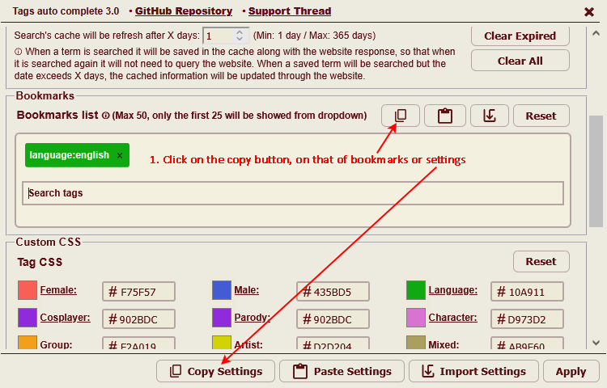 

Jump to:
- [Greasemonkey](#greasemonkey)
- [Tampermonkey](#tampermonkey)
- [Violentmonkey](#violentmonkey)

# Greasemonkey

## 2. Open the script manager and edit the script
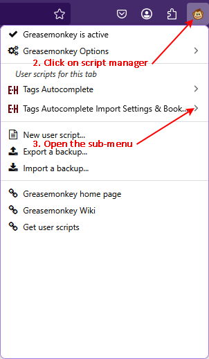
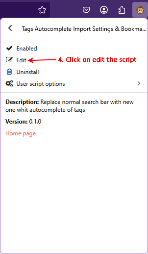

## 3. Scroll to the correct line and paste the the content copied in point [1](#1-copy-the-bookmarks-or-settings)
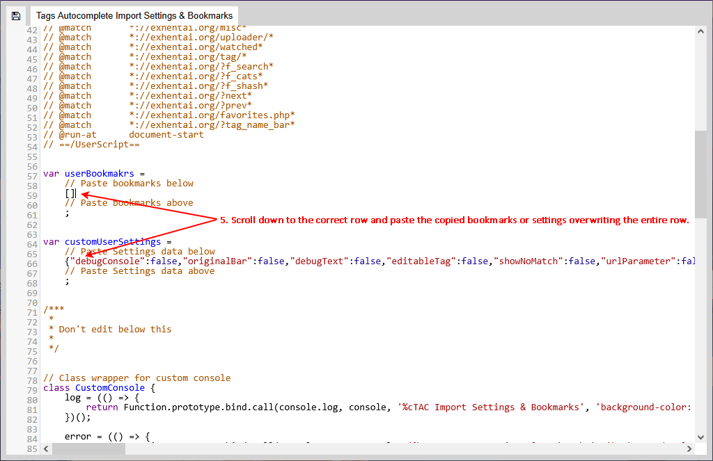
N.B. Paste the bookmarks at the line #59 and the settings to line #66

## 4. Save
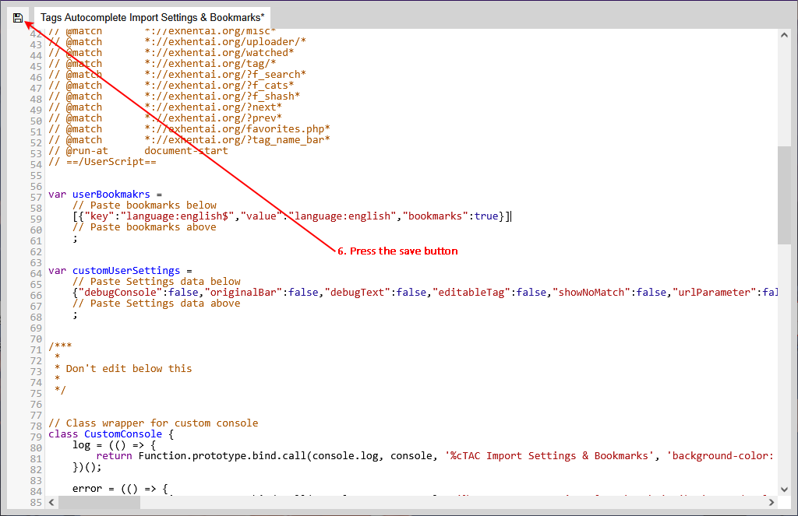

# Tampermonkey

## 2. Open the script manager and edit the script
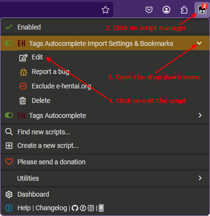

## 3. Scroll to the correct line and paste the the content copied in point [1](#1-copy-the-bookmarks-or-settings)
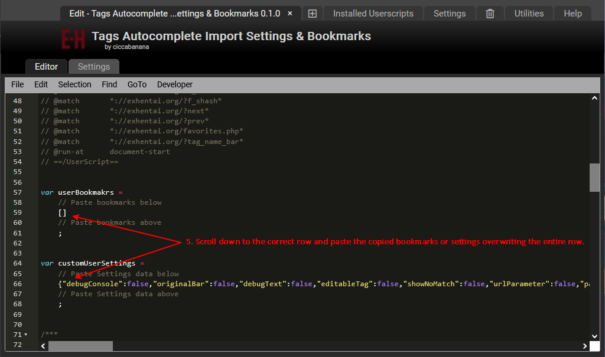
N.B. Paste the bookmarks at the line #59 and the settings to line #66

## 4. Save
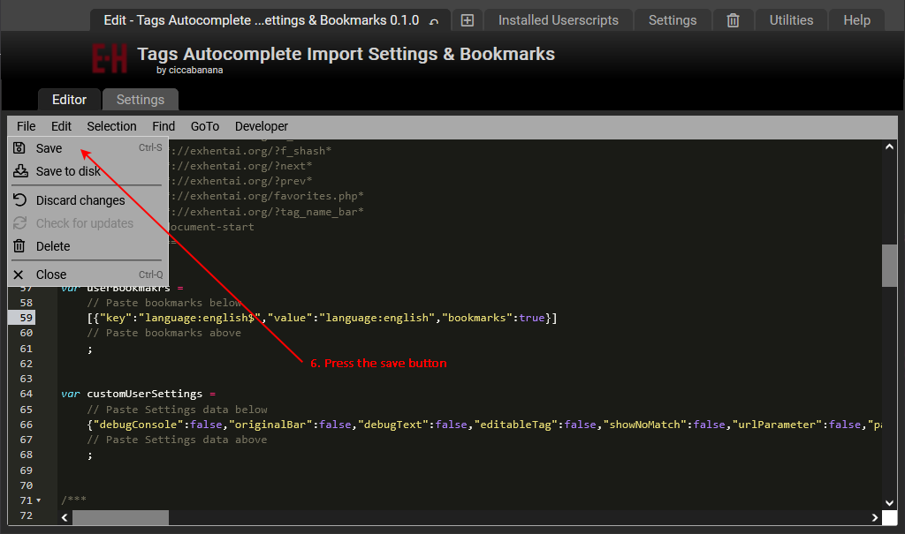

# Violentmonkey

## 2. Open the script manager and edit the script
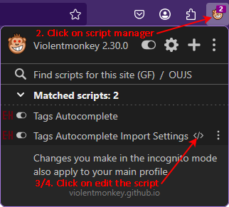

## 3. Scroll to the correct line and paste the the content copied in point [1](#1-copy-the-bookmarks-or-settings)
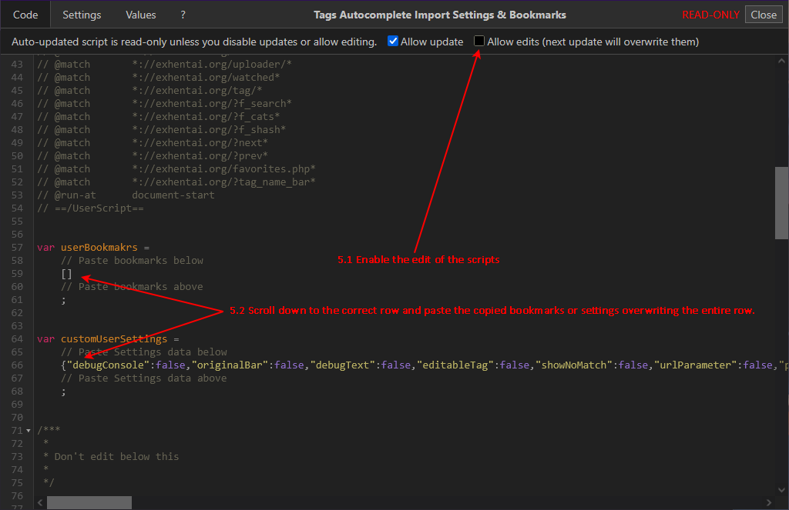
N.B. Paste the bookmarks at the line #59 and the settings to line #66

## 4. Save
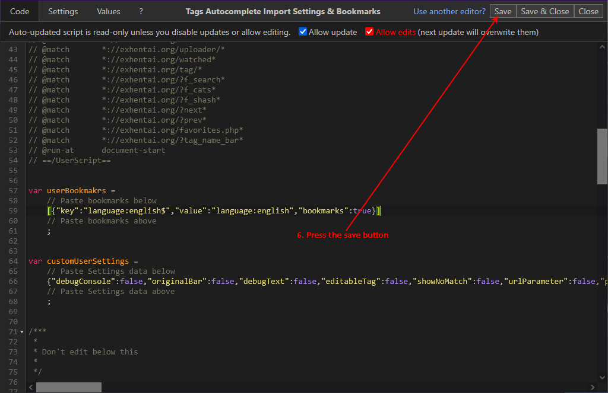

# End

## 5. Import every tine you need

 
